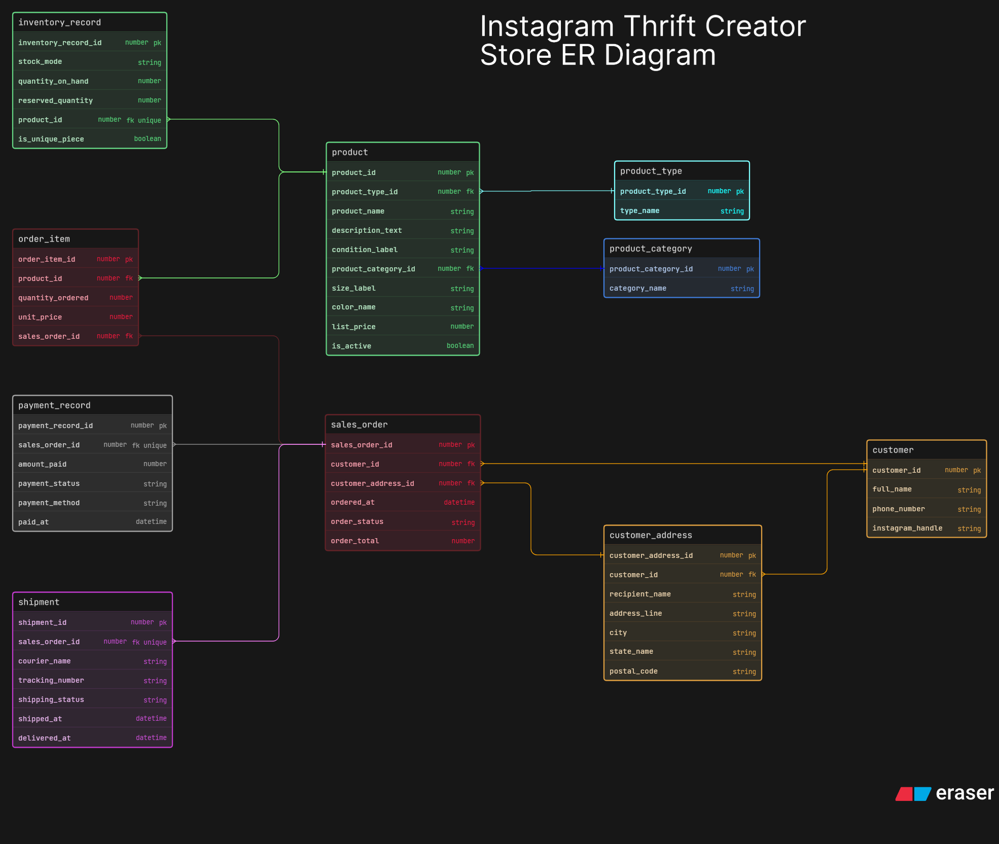

# Instagram Thrift Creator Store

This ER diagram models a small Instagram-based thrift and handmade store. The main idea behind the design was to avoid treating it like a generic ecommerce schema, because thrift items are often unique pieces while handmade products can exist in multiple units.

I kept the diagram focused on product listing, stock behavior, customer orders, payment tracking, and shipment flow. The goal was to make the business logic clear enough that a peer can look at the diagram and quickly understand how the store would work in practice.

## How I Structured The Design

1. I used `product_type` to separate thrift and handmade products.
2. I used `product_category` to group products in a cleaner way instead of keeping category text directly inside the product record.
3. I kept sellable product details inside `product`, but moved stock behavior into `inventory_record` so product description and inventory logic do not get mixed together.
4. I separated `customer` and `customer_address` because one customer can place multiple orders and may reuse the same address details.
5. I kept `sales_order`, `order_item`, `payment_record`, and `shipment` as separate entities so order flow, payment flow, aur delivery flow ek hi table me mix na ho.

## Main Tables And Why I Used Them

1. `product_type` tells whether the item is thrift or handmade.
2. `product_category` gives a cleaner product grouping structure.
3. `product` stores the actual sellable item details.
4. `inventory_record` stores quantity behavior and makes the unique-piece vs reusable-stock difference clearer.
5. `customer` stores buyer information.
6. `customer_address` stores delivery-related address details.
7. `sales_order` stores the main order record.
8. `order_item` handles the one-order-many-products case.
9. `payment_record` stores payment-specific information.
10. `shipment` stores shipping and tracking progress.

## Important Relationships

1. One `product_type` can be linked to many `product` records.
2. One `product_category` can also contain many products.
3. One `product` has one `inventory_record` that tracks how stock is managed for that item.
4. One `customer` can have multiple `sales_order` records over time.
5. One `sales_order` can contain multiple `order_item` records.
6. One `product` can appear in multiple `order_item` records across different orders.
7. One order can have a separate payment record and a separate shipment record.

## Key Design Decisions

1. I used `inventory_record` with `stock_mode`, `quantity_on_hand`, and `is_unique_piece` so thrift and handmade stock feel different in a practical way.
2. I kept payment and shipment outside the order table so the business flow looks more realistic and less cluttered.
3. I added a slightly better address structure and delivery fields so the order flow feels more usable in real life.
4. I kept the schema simple on purpose, but still detailed enough to show proper business understanding.

## Files

1. `eraser-diagram.txt` is the editable source I used for building the ER diagram in Eraser.
2. `er_diagram.png` is the final exported version of the submitted ER diagram.
