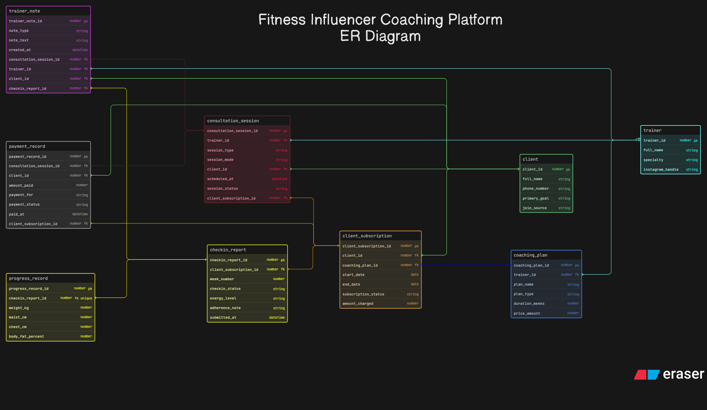

# Fitness Influencer Coaching Platform

This ER diagram models an online fitness coaching platform. The main thing I wanted to capture here was that this is not a gym-management system. It is a coaching ecosystem where trainers manage clients through plans, subscriptions, consultations, weekly check-ins, progress tracking, and payments.

I kept the design practical and readable so that the full coaching lifecycle is visible without making the schema unnecessarily complex. At the same time, I made sure that consultation-only clients and long-term subscription clients can both fit into the system.

## How I Structured The Design

1. I used `trainer` and `client` as separate entities because their roles in the platform are clearly different.
2. I created `coaching_plan` so trainers can define reusable plans or programs.
3. I used `client_subscription` to show which client purchased which plan and for what duration.
4. I kept `consultation_session` separate from subscriptions so one-time consultation clients bhi easily fit ho sakein, but still allowed sessions to optionally connect back to an active subscription.
5. I used `checkin_report` and `progress_record` separately because weekly check-ins and body measurements are related, but they are not the same thing.
6. I kept `trainer_note` and `payment_record` outside the main client tables so feedback and payment history remain properly structured.

## Main Tables And Why I Used Them

1. `trainer` stores coach-level information.
2. `client` stores client information and primary goals.
3. `coaching_plan` stores reusable coaching offerings.
4. `client_subscription` stores plan purchase and duration details.
5. `consultation_session` stores scheduled sessions between trainer and client.
6. `checkin_report` stores regular client check-in submissions.
7. `progress_record` stores body progress data linked to a check-in.
8. `trainer_note` stores coach feedback or notes.
9. `payment_record` stores money-related transactions for plans or consultations.

## Important Relationships

1. One `trainer` can create many `coaching_plan` records.
2. One `client` can purchase multiple `client_subscription` records over time.
3. One `coaching_plan` can be subscribed to by many clients.
4. One `client` can attend many `consultation_session` records.
5. One active subscription can also be linked to multiple related sessions.
6. One subscription can generate many `checkin_report` records.
7. One `checkin_report` can have one related `progress_record`.
8. Payments can be linked to either a consultation session or a subscription, which makes the model more flexible.

## Key Design Decisions

1. I kept sessions and check-ins separate because they serve different business workflows.
2. I added small practical fields like `amount_charged`, `join_source`, `payment_for`, and `payment_status` so the platform feels closer to something actually usable.
3. I kept progress outside the client table so profile data aur ongoing tracking data mix na ho.
4. I kept the schema simple enough for peer review, but structured enough to feel like a usable coaching platform.

## Files

1. `eraser-diagram.txt` is the editable source I used for the diagram.
2. `er_diagram.png` is the final exported version of the submitted ER diagram.
