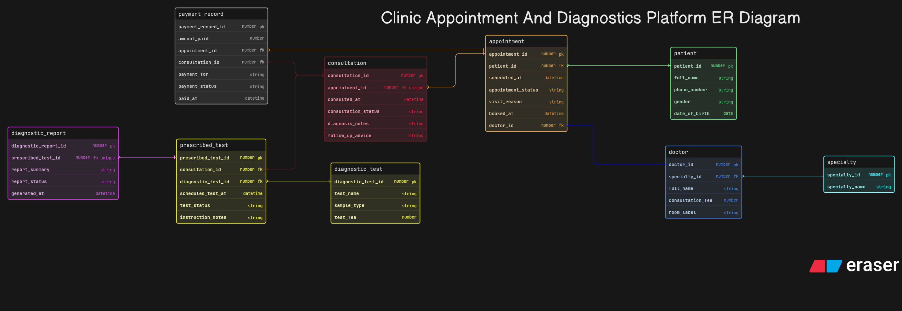

# Clinic Appointment And Diagnostics Platform

This ER diagram models a clinic workflow from appointment booking to consultation, prescribed tests, report generation, and payment. The main challenge in this assignment was to keep appointment data and actual visit data separate, because an appointment does not always guarantee that a consultation actually happens.

I designed the schema in a way that a peer can clearly see the full patient journey. Booking, consultation, tests, reports, and billing are all separated so the process feels closer to a real clinic system rather than a single-table design.

## How I Structured The Design

1. I used `specialty` and `doctor` separately so that multiple doctors can belong to the same specialty.
2. I kept `patient` separate from appointment data so repeated visits can be tracked properly.
3. I used `appointment` for the booking layer and `consultation` for the actual doctor visit layer.
4. I created `diagnostic_test` and `prescribed_test` separately so the clinic can maintain a reusable list of tests while still recording what was prescribed in a specific consultation.
5. I used `diagnostic_report` as a separate entity because reports are generated later and should not be mixed directly into consultations.
6. I kept `payment_record` separate so billing remains flexible and readable, and linked it in a way that can support appointment-level or consultation-level payment flow.

## Main Tables And Why I Used Them

1. `specialty` stores doctor specialty information.
2. `doctor` stores doctor details and links each doctor to one specialty.
3. `patient` stores patient details for repeat visits.
4. `appointment` stores scheduled booking information.
5. `consultation` stores the actual visit and diagnosis layer.
6. `diagnostic_test` stores the master list of available tests.
7. `prescribed_test` stores which tests were prescribed during a consultation.
8. `diagnostic_report` stores the generated result for a prescribed test.
9. `payment_record` stores payment details for the visit.

## Important Relationships

1. One `specialty` can be linked to many doctors.
2. One `patient` can book many appointments over time.
3. One `doctor` can receive many appointments and conduct many consultations.
4. One appointment can lead to at most one consultation in the modeled flow.
5. One consultation can lead to multiple `prescribed_test` records.
6. One prescribed test can generate one diagnostic report.
7. Payments are linked separately so the financial layer remains clean.

## Key Design Decisions

1. I separated booking and visit flow because that distinction is important in a clinic system.
2. I added a few practical appointment and report fields like `visit_reason`, `booked_at`, `report_status`, and `follow_up_advice` so the flow feels more complete without becoming hospital-level huge.
3. I kept prescribed tests and reports separate because both happen at different stages.
4. I avoided stuffing diagnostic and billing information directly inside consultation, taaki design zyada practical lage.

## Files

1. `eraser-diagram.txt` is the editable ERD source used for this diagram.
2. `er_daigram.png` is the final exported version of the submitted ER diagram.
