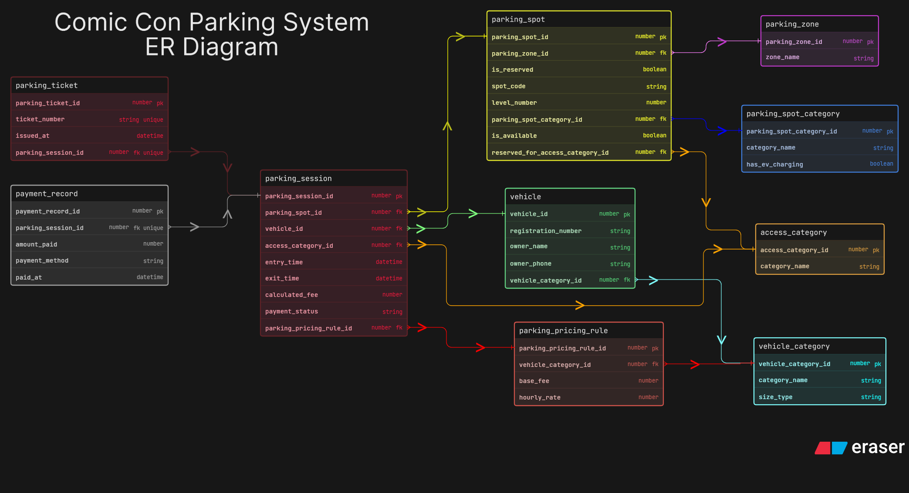

# Comic-Con Parking System

This ER diagram models a multi-zone parking system for Comic-Con India. The assignment required much more than a simple entry-exit tracker, so I focused on vehicle categories, reserved access logic, parking spot allocation, sessions, tickets, pricing, and payments as separate parts of the design.

My goal in this version was to keep the schema readable and submission-friendly while still covering the core parking flow properly. I wanted the diagram to show repeat vehicle visits, parking spot reuse, ticket generation, and payment handling in a way that a peer reviewer can understand without much confusion.

## How I Structured The Design

1. I used `vehicle_category` to classify the type of vehicle entering the venue.
2. I used `vehicle` to store actual vehicle details and link them back to a category.
3. I created `parking_zone` and `parking_spot_category` separately so the location of the spot and the type of spot do not get merged together.
4. I used `access_category` to represent reserved access groups such as VIP, staff, or exhibitors.
5. I used `parking_spot` to connect physical spot allocation with reservation logic.
6. I kept `parking_session` as the main transactional table because one entry and one exit should belong to one visit.
7. I used `parking_ticket`, `parking_pricing_rule`, and `payment_record` separately so ticketing, pricing, and payment logic stay independent.

## Main Tables And Why I Used Them

1. `vehicle_category` stores the type of vehicle.
2. `vehicle` stores the actual vehicle details.
3. `access_category` stores special access or reserved categories.
4. `parking_zone` stores the larger parking area.
5. `parking_spot_category` stores the physical type of parking spot.
6. `parking_spot` stores the actual assignable spot.
7. `parking_pricing_rule` stores fee calculation rules.
8. `parking_session` stores one visit of one vehicle.
9. `parking_ticket` stores the issued ticket details.
10. `payment_record` stores the payment details linked to the session.

## Important Relationships

1. One `vehicle_category` can have many `vehicle` records.
2. One `parking_zone` can contain many `parking_spot` records.
3. One `parking_spot_category` can be used by many parking spots.
4. One `access_category` can be linked to many parking spots and sessions.
5. One vehicle can have multiple `parking_session` records over time.
6. One parking spot can also appear in multiple sessions over time, which supports spot reuse.
7. One session can issue one ticket and link to one payment record in this design.

## Key Design Decisions

1. I kept parking session separate from ticket and payment so the design remains clean.
2. I used pricing as its own entity because fee calculation was an important part of the assignment.
3. I kept the ERD intentionally simple enough to read quickly, but still detailed enough to show the business flow clearly.

## Files

1. `eraser-diagram.txt` is the editable source for the original submitted diagram.
2. `er_diagram.png` is the final exported version of the original diagram.
3. `after-peer-review/` contains a separate improved version based on review feedback.
