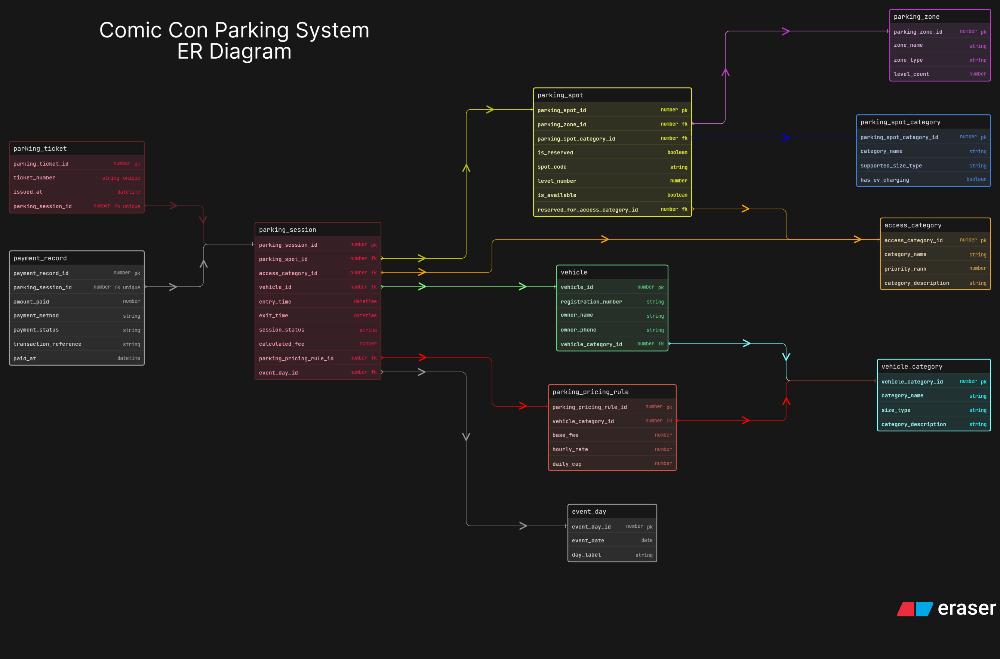

# Comic-Con Parking System - After Peer Review

This is the improved version of my day-04 parking ER diagram. I created this version after reading the peer-review feedback on the original submission so that I could refine the design without changing the first diagram that I had already submitted.

In this updated version, I focused on making the schema more complete and easier to justify. I added better support for multi-day event tracking, expanded some minimal entities, and reduced a few places where the design felt slightly incomplete or redundant.

The editable source for this improved version is stored in `eraser-diagram.txt`. The updated exported board is stored here as `er_diagram.png`.

## What I Improved

1. I added `event_day` so the parking system can clearly track sessions across different Comic-Con days.
2. I expanded `parking_zone` with `zone_type` and `level_count` so the zone table feels more useful and less minimal.
3. I expanded `access_category` with `priority_rank` and `category_description` so reserved access logic becomes easier to understand.
4. I kept `parking_spot_category` for the physical nature of the spot, while `access_category` now more clearly represents who the spot is reserved for.
5. I removed `payment_status` from `parking_session` and kept payment state inside `payment_record` so the payment flow stays cleaner.

## How I Structured The Diagram

1. `vehicle_category` stores the type of vehicle, such as bike, car, SUV, or EV.
2. `vehicle` stores the actual vehicle details and links each vehicle to one category.
3. `parking_zone` stores the larger parking area, and `parking_spot` links each spot to one zone.
4. `parking_spot_category` describes the kind of spot, for example whether it supports EV charging or a certain size type.
5. `access_category` represents reserved access rules such as VIP, staff, exhibitor, or similar special entry groups.
6. `parking_session` is the main transactional table where one visit of one vehicle is recorded with entry time, exit time, assigned spot, and fee calculation.
7. `parking_ticket` is kept separate so the issued ticket is not mixed directly into the session logic.
8. `payment_record` is also separate so payment method, status, and transaction details stay independent from parking movement data.

## Important Relationships

1. One `vehicle_category` can have many `vehicle` records.
2. One `parking_zone` can contain many `parking_spot` records.
3. One `parking_spot_category` can be used by many parking spots.
4. One `access_category` can be linked to many reserved parking spots and many parking sessions.
5. One vehicle can have many `parking_session` records over time, which supports repeat visits.
6. One parking spot can also appear in many `parking_session` records over time, which supports spot reuse.
7. One `parking_session` issues one `parking_ticket` and has one related `payment_record` in this version of the design.
8. One `event_day` can contain many `parking_session` records, which makes the multi-day event tracking explicit.

## Why This Version Is Better

1. The schema now reflects the fact that Comic-Con runs across multiple days.
2. The separation between spot type and reserved access is clearer than before.
3. Payment data is less repetitive and easier to explain.
4. The design still remains readable, but ab thoda more complete and practical feel deta hai.
