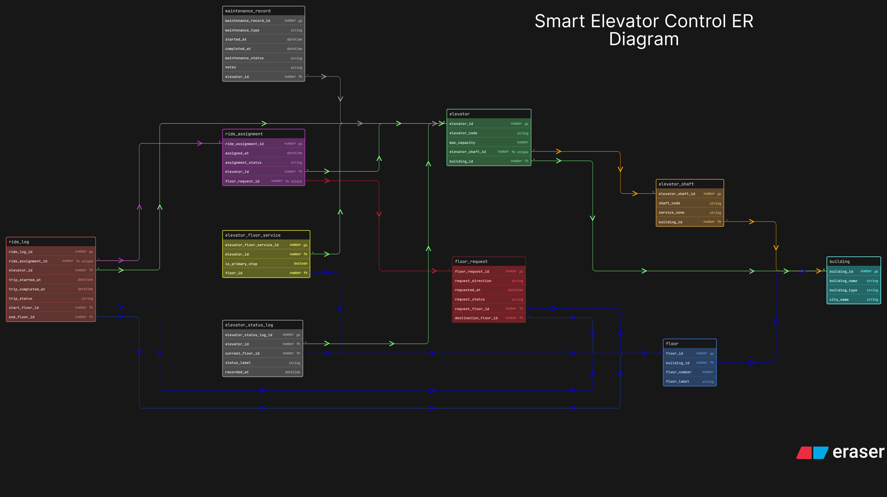

# Smart Elevator Control

This ER diagram models a smart elevator control platform for large buildings where multiple elevators operate together across many floors. The main challenge in this assignment was to keep building configuration separate from live operational activity such as ride requests, assignments, trip logs, status monitoring, and maintenance history.

I designed the schema in a way that clearly separates static infrastructure from dynamic movement data. That makes the system easier to explain and also closer to how a real monitoring platform would be structured.

## How I Structured The Design

1. I used `building` as the top-level entity because the platform works across multiple connected buildings.
2. I created `floor` separately so each building can have many floors.
3. I used `elevator_shaft` and `elevator` separately because one shaft contains one elevator, and that structure was recommended in the assignment.
4. I added `elevator_floor_service` as a junction table so the many-to-many relationship between elevators and floors can be modeled properly.
5. I kept `floor_request`, `ride_assignment`, and `ride_log` separate so request generation, elevator allocation, aur completed trip history ek hi table me mix na ho.
6. I also used `elevator_status_log` and `maintenance_record` separately because live status tracking and maintenance history are different concerns.

## Main Tables And Why I Used Them

1. `building` stores building-level information.
2. `floor` stores floor information for each building.
3. `elevator_shaft` stores shaft-level structure.
4. `elevator` stores the actual elevator configuration.
5. `elevator_floor_service` stores which floors each elevator can serve.
6. `floor_request` stores requests generated from floors.
7. `ride_assignment` stores which elevator was assigned to a request.
8. `ride_log` stores completed or tracked ride history.
9. `elevator_status_log` stores status snapshots for monitoring.
10. `maintenance_record` stores maintenance events separately from normal ride data.

## Important Relationships

1. One building can have many floors.
2. One building can also have many elevator shafts and elevators.
3. One elevator can serve many floors, and one floor can be served by multiple elevators.
4. One floor request can be assigned to one elevator through `ride_assignment`.
5. One assigned ride can create one `ride_log` entry.
6. One elevator can have many status records and many maintenance records over time.

## Key Design Decisions

1. I avoided storing ride activity directly inside the elevator table.
2. I used a separate service junction table because floor-elevator servicing is clearly many-to-many.
3. I kept maintenance and status history separate so the operational timeline remains clean and realistic.

## Files

1. `eraser-diagram.txt` is the editable source used to build the ER diagram.
2. `er_diagram.png` is the exported diagram image used for review.
