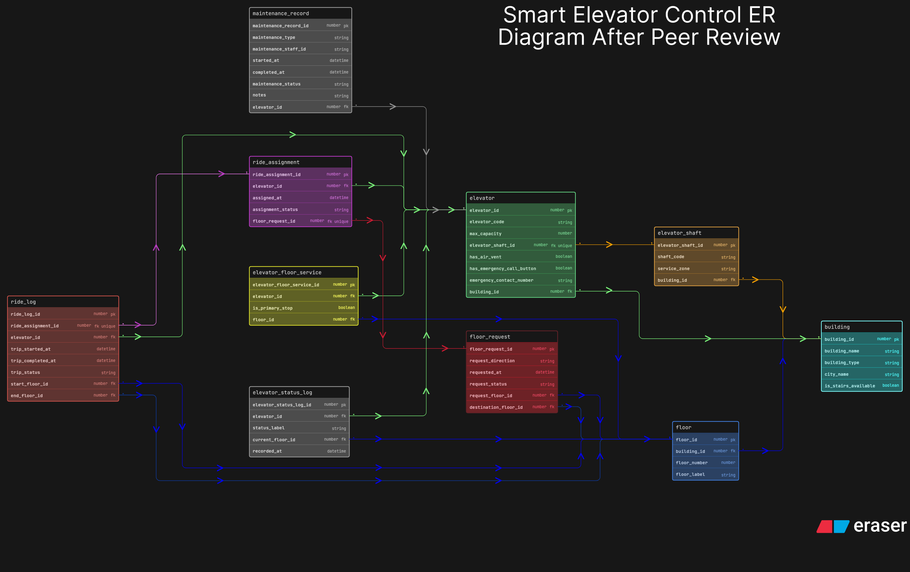

# Smart Elevator Control - After Peer Review

This is the improved version of my day-05 elevator ER diagram. I created this version after reading the peer-review feedback on the original submission so that I could refine the design without changing the first diagram that I had already submitted.

In this updated version, I kept the original flow intact because the main structure was already working around `building`, `floor`, `elevator_shaft`, `elevator`, `floor_request`, `ride_assignment`, `ride_log`, `elevator_status_log`, and `maintenance_record`. The goal here was not to redesign everything, but to add a few practical improvements that make the model feel more realistic.

The editable source for this improved version is stored in `eraser-diagram.txt`, and the exported board image is stored as `er_diagram.png`.

## What I Improved

1. I added `is_stairs_available` in `building` so the structure also reflects the practical fallback when elevator service is unavailable.
2. I expanded `elevator` with `has_air_vent`, `has_emergency_call_button`, and `emergency_contact_number` so the elevator configuration feels more realistic from a safety point of view.
3. I added `maintenance_staff_id` in `maintenance_record` so maintenance tracking has better accountability.
4. I kept `elevator.elevator_shaft_id` as `unique`, which already makes the shaft-to-elevator relationship behave like one shaft containing one elevator.

## What I Did Not Add

1. I did not add resident IDs, visitor IDs, staff IDs, fingerprint-entry details, or building population fields.
2. I skipped those because they move the schema toward building access or resident management, while the assignment was mainly about elevator control, floor requests, ride allocation, status monitoring, and maintenance tracking.

## How I Structured The Diagram

1. `building`, `floor`, `elevator_shaft`, and `elevator` represent the static infrastructure side of the platform.
2. `elevator_floor_service` still handles the many-to-many relation between elevators and floors.
3. `floor_request`, `ride_assignment`, and `ride_log` keep the ride flow separated into request, allocation, and trip history.
4. `elevator_status_log` and `maintenance_record` stay separate from configuration tables so live operational data does not get mixed into elevator setup.

## Why This Version Is Better

1. It keeps the original clean structure instead of overcomplicating the design.
2. It adds a few practical real-world fields that improve safety and maintenance tracking.
3. It stays close to the assignment scope, so schema writing later should remain easier and more manageable.

## Files

1. `eraser-diagram.txt` is the updated editable source after peer review.
2. `er_diagram.png` is the exported diagram image for this improved version.
