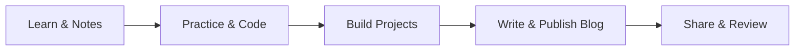

# Chaicode Cohort 2.0

> A structured full stack learning system built around classes, practice, tracking, projects, and public writing.


## Table of Contents

- [About This Repository](#about-this-repository)
- [Current State](#current-state)
- [Repository Structure](#repository-structure)
- [Core Repo Hubs](#core-repo-hubs)
- [How I Use This Repo](#how-i-use-this-repo)
- [Blog And Writing System](#blog-and-writing-system)
- [Why The Structure Matters](#why-the-structure-matters)
- [Good Entry Points](#good-entry-points)
## About This Repository

This repository is my main cohort workspace.

It is not just a place to dump files. It is a system I use to:

- learn in a more organized way
- revise concepts properly
- keep class work and practice connected
- track progress honestly
- turn learning into public writing through blogs

The goal is simple: make the cohort journey readable, useful, and maintainable for both future me and anyone visiting the repo.

## Current State

The repo has moved beyond the basic setup stage.

What is already in place:

- class-wise folders for tools, fundamentals, frontend, JavaScript, backend, T-classes, peer classes, and peer reviews
- tracking files for roadmap and real progress
- a centralized blog workspace inside `43_BLOGS/`
- published Hashnode blog tracking
- a resource hub for tools, docs, and publishing references
- a cleaner system for connecting class folders with blog drafts instead of duplicating article content
- a cleaner separation between tracking docs and larger standalone project repos

Current blog snapshot:

- published articles: `54`
- all `15` series are completed and live on Hashnode
- blog navigation pages are also maintained from this repo

## Repository Structure

The repository mirrors the actual cohort dashboard to keep the learning path clear and serialized:

### Core Curriculum

```text
00_TRACKING/                   -> roadmap, progress, planning
01_TOOLS/                      -> tools, setup, Git intro, workflow basics
02_FUNDAMENTALS/               -> networking, DNS, client-server, internet basics
03_BUILDING_BLOCKS/            -> HTML and CSS foundations
04_INTERACTING_WITH_BROWSER/   -> browser JavaScript and async concepts
05_BACKEND_ENGINEERING/        -> backend engineering and Node.js classes
06_FRONTEND_REACT/             -> frontend engineering and React.js ecosystem
```

### Support & Revision

```text
31_T_CLASSES/                  -> Thursday reinforcement classes
32_PEER_CLASSES/               -> Friday peer-led classes
```

### Portfolio & Outputs

```text
41_PEER_REVIEWS/               -> peer-review assignment index and submission links
42_PROJECTS/                   -> cohort and personal project showcases and links
43_BLOGS/                      -> blog drafts, publish tracking, Hashnode workflow
44_HACKATHONS/                 -> hackathon showcases and external project links
```

### Practical Resources

```text
90_RESOURCES/                  -> useful tools, docs, references, publishing resources
```

Each structured class folder now follows this pattern:

```text
class-name/
|
+-- assignments/    -> assignment work or submissions
+-- class-code/     -> instructor reference code or cohort code
+-- class-notes/    -> notes, PDFs, or reference material when available
+-- practice/       -> my implementation, revision work, and experiments
+-- links.md        -> useful links, docs, notes, and blog references
+-- README.md       -> concept summary in my own words
```

Notes:

- some folders are prepared in advance for consistency
- placeholders may exist where the structure is ready but work is still pending

## Core Repo Hubs

### `00_TRACKING`

This is the planning and visibility layer of the repo.

- `progress.md` tracks class attendance, rewatch status, notes, practice, assignments, and blog growth
- `roadmap.md` tracks the larger long-term learning direction

### `01_TOOLS` to `30_...` (Core Curriculum)

This block holds the actual step-by-step technical learning. 
It starts with fundamental workflows and builds up to complex backend systems.

- `01_TOOLS`: Version control and IDE workflows.
- `02_FUNDAMENTALS`: Internet architecture and networking.
- `03_BUILDING_BLOCKS`: HTML and CSS logic.
- `04_INTERACTING_WITH_BROWSER`: Advanced JavaScript and async execution.
- `05_BACKEND_ENGINEERING`: Servers, databases, and system architecture.
- `06_FRONTEND_REACT`: React.js, UI engineering, and frontend frameworks.

*(Note: Folders `07` through `30` are intentionally reserved here for upcoming core modules like Next.js and Fullstack Projects).*

### `31_T_CLASSES`

This is the Thursday reinforcement section.

It tracks special technical deep-dives, doubt-clearing sessions, and career logic classes led by the instructor.

### `32_PEER_CLASSES`

This is the Friday peer-class section.

It only tracks the actual peer-led live classes of the cohort.

### `41_PEER_REVIEWS`

This is the peer-review assignment section.

It works as a discovery layer for assignments that may belong to earlier class topics but are reviewed by cohort peers on the platform.

- assignment work still stays in the original class folder where the topic belongs
- peer reviews can include code, blogs, ER diagrams, and other submission formats
- code-heavy peer reviews can point to separate standalone repositories
- this section links back to those original class folders so peer-review tasks stay easy to find

### `42_PROJECTS`

This keeps project showcases separate from class folders.

It includes:

- cohort platform project references
- personal project references
- GitHub repo links
- live demo links
- lightweight project summaries

Actual deployable project code can live in a separate GitHub repository when the project needs a clean public repo and Vercel deployment.

This folder should stay tracking-focused, not implementation-heavy.

### `43_BLOGS`

This is the writing and publishing system.

It includes:

- article drafts grouped into numbered series folders
- special Hashnode page drafts like `Start Here` and `Explore by Topic`
- publishing helpers in `43_BLOGS/txt/`
- `published-links.md` for live article and series tracking

This keeps blog writing centralized while class folders only keep references.

### `44_HACKATHONS`

This keeps hackathon work separate from normal projects and class learning.

Actual hackathon code should live in its own GitHub repository so deployment, starter code, schema docs, and submission work stay clean. This repo only keeps public-safe references like repo links, live links, demo links, problem statement summaries, and learning notes.

This folder should stay tracking-focused, not implementation-heavy.

### `90_RESOURCES`

This is the practical resource hub.

It includes:

- tools
- official docs
- platform links
- publishing references
- workflow helpers that are actually used during the cohort

## How I Use This Repo

My usual loop looks like this:

1. attend or cover the class
2. collect useful links and references
3. rewrite the concept in my own words
4. practice separately
5. track the real status honestly
6. write blogs once the concept becomes clear enough to explain



This helps me avoid passive learning and gradually turn the cohort into a working knowledge base.

## Blog And Writing System

Writing is part of learning here, not a side activity.

The blog workflow is intentionally structured:

1. draft the article in `43_BLOGS/drafts/`
2. keep title, subheadline, slug, and SEO details organized
3. prepare cover and inline image prompts
4. publish on Hashnode in the correct series
5. update `published-links.md`
6. update relevant class `links.md` files if needed

Main blog-related files:

- [Blogs README](43_BLOGS/README.md)
- [Published Links](43_BLOGS/published-links.md)
- [Start Here Draft](43_BLOGS/drafts/00-start-here-my-web-development-learning-path.md)
- [Explore by Topic Draft](43_BLOGS/drafts/00-explore-by-topic-every-series-in-one-place.md)

Public blog entry points:

- [Hashnode Blog](https://prashsainidev.hashnode.dev/)
- [Start Here Page](https://prashsainidev.hashnode.dev/page/web-development-learning-path)
- [Explore by Topic Page](https://prashsainidev.hashnode.dev/page/topics)

## Why The Structure Matters

This repo is designed to stay readable over time.

That means:

- class folders explain concepts and hold related practice
- tracking files show the real state of progress
- blog drafts stay centralized instead of being copied everywhere
- resource files reduce repeated searching and confusion

The point is not just to store work. The point is to create a system that supports learning, revision, and communication.

## Good Entry Points

If someone is visiting this repo for the first time, the best places to start are:

- [Progress Tracker](00_TRACKING/progress.md)
- [Learning Roadmap](00_TRACKING/roadmap.md)
- [Blogs Index](43_BLOGS/README.md)
- [Projects Index](42_PROJECTS/README.md)
- [Hackathons Index](44_HACKATHONS/README.md)
- [Published Blogs List](43_BLOGS/published-links.md)
- [Resources Hub](90_RESOURCES/resources.md)

## Disclaimer

This repository contains my personal notes, summaries, structure, practice, and writing workflow.

- course content belongs to Chaicode
- this repo is not a reupload of paid material
- what is documented here is my interpretation, revision system, and implementation work

## Final Thought

Consistency matters more than intensity.

A clean learning system starts as documentation, but over time it becomes proof of discipline, clarity, and growth.
